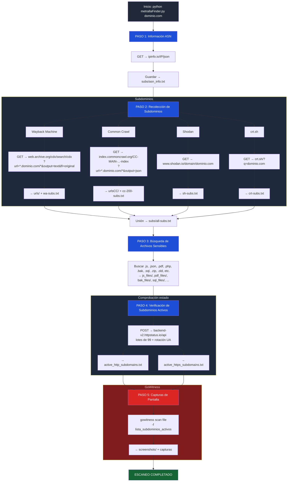

# RECON - (Almost) Passive Recon & Subdomain Enumeration Tool

**Author:** 0xCOrS (with a little help from Claude)  
**Language:** Python 3.9+  
**Type:** Almost passive reconnaissance (until optional screenshot phase)

_As usual, expect some spanglish_

A fast, aggressive and almost completely passive reconnaissance tool for bug bounty hunters and red teamers.  
One single command → thousands of subdomains + historical URLs + juicy files + live checks + screenshots.

If the Recon MUST be 100% passive, comment 916 & 917 lines of metrallaFinder.py

## Features

- 100 % passive until the optional screenshot phase
- Subdomain enumeration from:
  - Wayback Machine (CDX API)
  - Common Crawl (latest index)
  - crt.sh (Certificate Transparency logs)
  - Shodan domain view
- Historical URLs saved and grouped by subdomain
- Automatic hunting of 18 sensitive file extensions (`.js`, `.json`, `.pdf`, `.php`, `.bak`, `.zip`, `.sql`, databases, backups…)
- Live subdomain checking (HTTP + HTTPS) via httpstatus.io bulk API → no direct connections to target
- Single-run screenshot of every alive subdomain using **gowitness**
- Clean output structure + detailed execution log

## Output directory structure

```text
example.com/
├── subs/
│   ├── all-subs.txt
│   ├── wa-subs.txt
│   ├── cc-subs.txt
│   ├── sh-subs.txt
│   ├── crt-subs.txt
│   └── asn_info.txt
├── urls/                  → Wayback Machine URLs (one file per subdomain)
├── urlsCC/                → Common Crawl URLs (one file per subdomain)
├── urls200/               → (optional) only 200-response URLs
├── status_check/
│   ├── active_http_subdomains.txt
│   └── active_https_subdomains.txt
├── screenshots/           → gowitness screenshots + index.html + CSV report
├── <extension>_files/              → URLs pointing to .<extension> files
└── bbhunting.log          → complete execution log
```

Folders for file extensions are created only when results exist.

## Installation
```bash
pip install -r requirements.txt

# Install gowitness (required for screenshots)
go install github.com/sensepost/gowitness@latest
```

## Usage
```bash
python3 metrallaFinder.py example.com
```

## Flow



 

